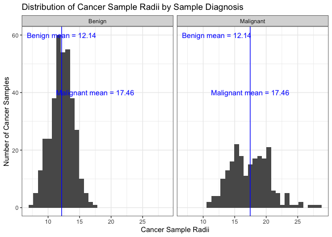
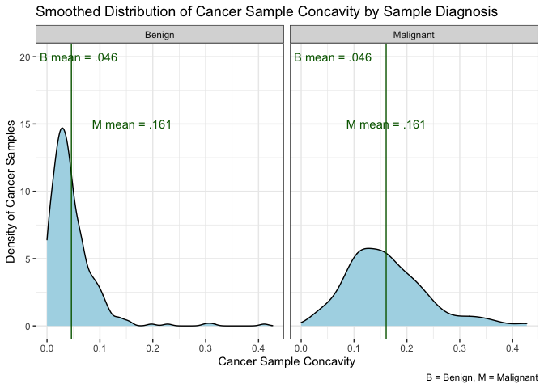
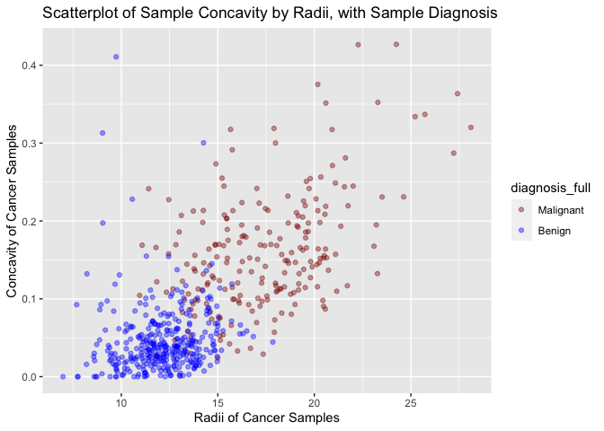
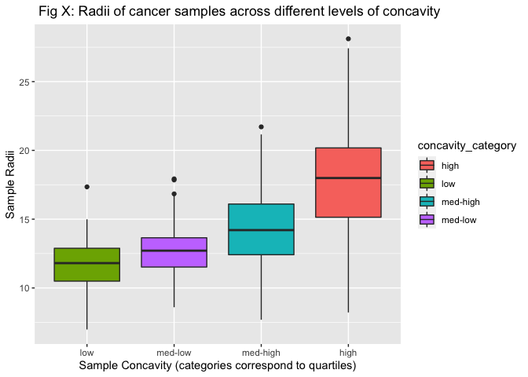
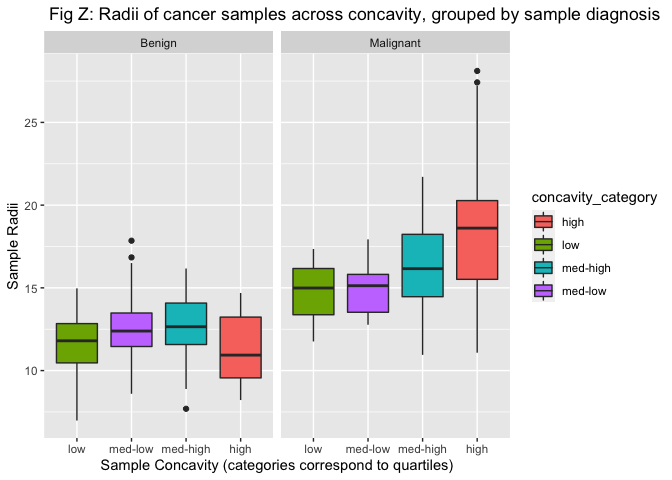
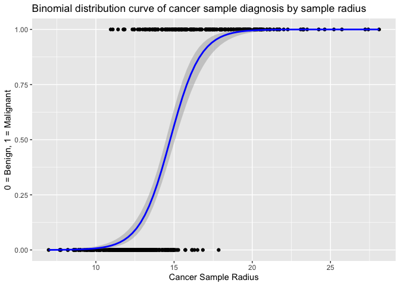
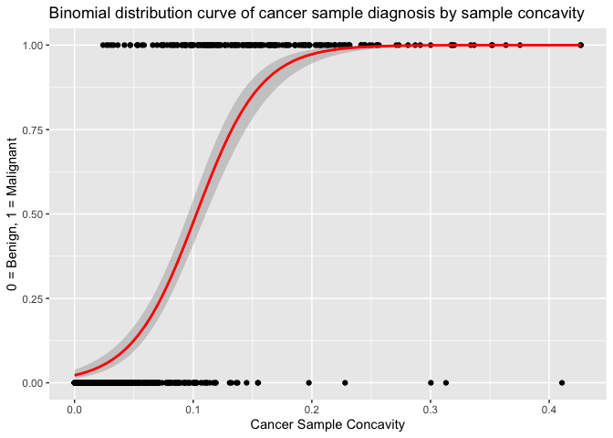

Mini Data Analysis Milestone 2
================
Sidney S.

*To complete this milestone, you can either edit [this `.rmd`
file](https://raw.githubusercontent.com/UBC-STAT/stat545.stat.ubc.ca/master/content/mini-project/mini-project-2.Rmd)
directly. Fill in the sections that are commented out with
`<!--- start your work here--->`. When you are done, make sure to knit
to an `.md` file by changing the output in the YAML header to
`github_document`, before submitting a tagged release on canvas.*

# Welcome to the rest of your mini data analysis project!

In Milestone 1, you explored your data. and came up with research
questions. This time, we will finish up our mini data analysis and
obtain results for your data by:

- Making summary tables and graphs
- Manipulating special data types in R: factors and/or dates and times.
- Fitting a model object to your data, and extract a result.
- Reading and writing data as separate files.

We will also explore more in depth the concept of *tidy data.*

**NOTE**: The main purpose of the mini data analysis is to integrate
what you learn in class in an analysis. Although each milestone provides
a framework for you to conduct your analysis, it’s possible that you
might find the instructions too rigid for your data set. If this is the
case, you may deviate from the instructions – just make sure you’re
demonstrating a wide range of tools and techniques taught in this class.

# Instructions

**To complete this milestone**, edit [this very `.Rmd`
file](https://raw.githubusercontent.com/UBC-STAT/stat545.stat.ubc.ca/master/content/mini-project/mini-project-2.Rmd)
directly. Fill in the sections that are tagged with
`<!--- start your work here--->`.

**To submit this milestone**, make sure to knit this `.Rmd` file to an
`.md` file by changing the YAML output settings from
`output: html_document` to `output: github_document`. Commit and push
all of your work to your mini-analysis GitHub repository, and tag a
release on GitHub. Then, submit a link to your tagged release on canvas.

**Points**: This milestone is worth 50 points: 45 for your analysis, and
5 for overall reproducibility, cleanliness, and coherence of the Github
submission.

**Research Questions**: In Milestone 1, you chose two research questions
to focus on. Wherever realistic, your work in this milestone should
relate to these research questions whenever we ask for justification
behind your work. In the case that some tasks in this milestone don’t
align well with one of your research questions, feel free to discuss
your results in the context of a different research question.

# Learning Objectives

By the end of this milestone, you should:

- Understand what *tidy* data is, and how to create it using `tidyr`.
- Generate a reproducible and clear report using R Markdown.
- Manipulating special data types in R: factors and/or dates and times.
- Fitting a model object to your data, and extract a result.
- Reading and writing data as separate files.

# Setup

Begin by loading your data and the tidyverse package below:

``` r
rm(list=ls())
library(datateachr) # <- might contain the data you picked!
library(tidyverse)
```

# Task 1: Process and summarize your data

From milestone 1, you should have an idea of the basic structure of your
dataset (e.g. number of rows and columns, class types, etc.). Here, we
will start investigating your data more in-depth using various data
manipulation functions.

### 1.1 (1 point)

First, write out the 4 research questions you defined in milestone 1
were. This will guide your work through milestone 2:

<!-------------------------- Start your work below ---------------------------->

1.  *Do malignant versus benign tumours differ in their radius
    (radius_mean)? If so, by how much?*
2.  *Do malignant versus benign tumours differ in their concavity
    (concavity_mean)? If so, by how much?*
3.  *Can we use tumour radius and/or concavity to predict the
    diagnosis?*
4.  *Are sample concavity and radius related? (amongst both benign and
    malignant tumours?)*

*NOTE: In the interest of readability/flow of my analysis, I have
re-written research questions 1 & 2 (in part 1 of my analysis, questions
1 and 2 were written as: 1. Do malignant versus benign tumours differ in
their radius (radius_mean) and/or concavity (concavity_mean)?; 2.
follow-up research question 1: if so, by how much?*

<!----------------------------------------------------------------------------->

Here, we will investigate your data using various data manipulation and
graphing functions.

### 1.2 (8 points)

Now, for each of your four research questions, choose one task from
options 1-4 (summarizing), and one other task from 4-8 (graphing). You
should have 2 tasks done for each research question (8 total). Make sure
it makes sense to do them! (e.g. don’t use a numerical variables for a
task that needs a categorical variable.). Comment on why each task helps
(or doesn’t!) answer the corresponding research question.

Ensure that the output of each operation is printed!

Also make sure that you’re using dplyr and ggplot2 rather than base R.
Outside of this project, you may find that you prefer using base R
functions for certain tasks, and that’s just fine! But part of this
project is for you to practice the tools we learned in class, which is
dplyr and ggplot2.

**Summarizing:**

1.  Compute the *range*, *mean*, and *two other summary statistics* of
    **one numerical variable** across the groups of **one categorical
    variable** from your data.
2.  Compute the number of observations for at least one of your
    categorical variables. Do not use the function `table()`!
3.  Create a categorical variable with 3 or more groups from an existing
    numerical variable. You can use this new variable in the other
    tasks! *An example: age in years into “child, teen, adult, senior”.*
4.  Compute the proportion and counts in each category of one
    categorical variable across the groups of another categorical
    variable from your data. Do not use the function `table()`!

**Graphing:**

6.  Create a graph of your choosing, make one of the axes logarithmic,
    and format the axes labels so that they are “pretty” or easier to
    read.
7.  Make a graph where it makes sense to customize the alpha
    transparency.

Using variables and/or tables you made in one of the “Summarizing”
tasks:

8.  Create a graph that has at least two geom layers.
9.  Create 3 histograms, with each histogram having different sized
    bins. Pick the “best” one and explain why it is the best.

Make sure it’s clear what research question you are doing each operation
for!

<!------------------------- Start your work below ----------------------------->

### Research Question 1 (RQ1)

#### Summarizing (task 1; ST1):

#### Note for all below: I can safely omit na.rm = TRUE from much code since I have already checked that this data frame is complete!

*‘Do malignant versus benign tumours differ in their radius
(radius_mean)? If so, by how much?’ (1) –\> ‘1. Compute the range, mean,
and two other summary statistics of one numerical variable across the
groups of one categorical variable from your data.’*

``` r
head(cancer_sample, n=3)
```

    ## # A tibble: 3 × 32
    ##         ID diagnosis radius_mean texture_mean perimeter_mean area_mean
    ##      <dbl> <chr>           <dbl>        <dbl>          <dbl>     <dbl>
    ## 1   842302 M                18.0         10.4           123.      1001
    ## 2   842517 M                20.6         17.8           133.      1326
    ## 3 84300903 M                19.7         21.2           130       1203
    ## # ℹ 26 more variables: smoothness_mean <dbl>, compactness_mean <dbl>,
    ## #   concavity_mean <dbl>, concave_points_mean <dbl>, symmetry_mean <dbl>,
    ## #   fractal_dimension_mean <dbl>, radius_se <dbl>, texture_se <dbl>,
    ## #   perimeter_se <dbl>, area_se <dbl>, smoothness_se <dbl>,
    ## #   compactness_se <dbl>, concavity_se <dbl>, concave_points_se <dbl>,
    ## #   symmetry_se <dbl>, fractal_dimension_se <dbl>, radius_worst <dbl>,
    ## #   texture_worst <dbl>, perimeter_worst <dbl>, area_worst <dbl>, …

``` r
# In order to investigate if malognant (M) versus benign (B) tumours differ in their radius, I wil compute the range, mean, standard deviation (SD), and median across the groups of sample diagnosis (M versus B)
## I will also leave the min and max values of radii by sample diagnosis in (at end of the summary table), just to characterize the radii range.

cancer_sample %>%
    mutate(diagnosis_full = ifelse(diagnosis=="M", "Malignant", "Benign")) %>%   # NB the 'ifelse' statement is fine - since I have checked that the only values for 'diagnosis' are 'M' and 'B' (and there are 0 missing values)
  select(diagnosis_full, radius_mean) %>%
  group_by(diagnosis_full) %>%
  summarise(mean_rad = mean(radius_mean),
            range_rad =  (max(radius_mean) - min(radius_mean)),
             SD_rad = sd(radius_mean), 
            median_rad = median(radius_mean), 
             min_rad = min(radius_mean),
            max_rad = max(radius_mean))
```

    ## # A tibble: 2 × 7
    ##   diagnosis_full mean_rad range_rad SD_rad median_rad min_rad max_rad
    ##   <chr>             <dbl>     <dbl>  <dbl>      <dbl>   <dbl>   <dbl>
    ## 1 Benign             12.1      10.9   1.78       12.2    6.98    17.8
    ## 2 Malignant          17.5      17.2   3.20       17.3   11.0     28.1

``` r
# It seems like malignant ('M') samples/tumours generally had a larger radius (based on the 'mean_rad' column in outbput) than benign ('B') ones. The difference in the range & standard deviation columns (3 and 4 in output) by tumour/sample diagnosis (showing that radii range and SD is greater for malignant tumours), we can see there is more variance in radii for malignant cancer samples.
```

### Research Question 1 (RQ1)

#### Graphing (task 8; GT8):

*‘Do malignant versus benign tumours differ in their radius
(radius_mean)? If so, by how much?’ (1) –\> ‘Using variables and/or
tables you made in one of the “Summarizing” tasks: 8. Create a graph
that has at least two geom layers.’*

``` r
# To continue my investigation I want to graph the distribution of sample radii by their diagnosis (that I characterized with mean, sd, range, etc, above):

cancer_sample %>%
  mutate(diagnosis_full = ifelse(diagnosis=="M", "Malignant", "Benign")) %>% 
  # make a new varaiable that has the full sample diagnosis names (not just M/B) for a clear graph
  group_by(diagnosis_full) %>%
           mutate(mean_rad = mean(radius_mean)) %>%
  # get the mean radius by diagnosis and call it 'mean_rad'[1]
  ggplot(aes(x=radius_mean)) + 
  # make a plot with radius on the x axis
  geom_histogram() +
  # make it a histogram
  facet_wrap(~diagnosis_full) + 
  # split it into 2 histograms by cancer sample classification
  geom_vline(aes(xintercept=mean_rad, group = diagnosis_full), colour = "blue") +
  # add a blue x intercept at the mean sample radius for both benign and malignant [1]
  ylab("Number of Cancer Samples") +
  xlab("Cancer Sample Radii") +
  ggtitle("Distribution of Cancer Sample Radii by Sample Diagnosis") +
  # add titles 
   annotate("text", x=12.14, y=60, label= "Benign mean = 12.14", colour = "blue") + # adding the radius means by group/diagnosis, from my summary table in above chunk [2]
  annotate("text", x=17.46, y=40, label= "Malignant mean = 17.46", colour = "blue") +
    theme_bw()
```

    ## `stat_bin()` using `bins = 30`. Pick better value with `binwidth`.

<!-- -->

``` r
# This graph illustrates what the summary table I already made indicated about differences in variation and average in sample radii by whether the cancer was malignant or benign. It suggests that the answer to my first research question: "Do malignant versus benign tumours differ in their radius (radius_mean)? If so, by how much?" Is: Yes, malignant tumours have about 40% more radius versus benign ones. 
17.46/12.14*100
```

    ## [1] 143.8221

``` r
## References:
# [1] Gnueghoidune (2022) on Stalk overflow provided syntax that was the basis / inspiration for adding the correct (grouped - not overall) mean of radius by sample diagnosis (https://stackoverflow.com/questions/71742365/how-do-i-add-a-mean-line-to-each-panel-is-a-facet-grid-object) 
# [2] Statology (n.d.) https://www.statology.org/add-text-to-ggplot/, for labelling radii means by group
```

## Research Question 2

## Summarizing Task 1

*Do malignant versus benign tumours differ in their concavity
(concavity_mean)? If so, by how much? (2) -\> ‘1. Compute the range,
mean, and two other summary statistics of one numerical variable across
the groups of one categorical variable from your data.’*

``` r
# In order to investigate if malognant (M) versus benign (B) tumours differ in their concavity, I wil compute the range, mean, standard deviation (SD), and median across the groups of sample diagnosis (M versus B)
## I will also leave the min and max values of concavity by sample diagnosis in (at end of the summary table), just to characterize the concavity range.

cancer_sample %>%
  mutate(diagnosis_full = ifelse(diagnosis=="M", "Malignant", "Benign")) %>%  # Note that this is fine because I know there are 0 missing values in this df
  select(diagnosis_full, concavity_mean) %>%
  group_by(diagnosis_full) %>%
  summarise(mean_conc = mean(concavity_mean),
            range_conc =  (max(concavity_mean) - min(concavity_mean)),
             SD_conc = sd(concavity_mean), 
            median_conc = median(concavity_mean), 
             min_conc = min(concavity_mean),
            max_conc = max(concavity_mean))
```

    ## # A tibble: 2 × 7
    ##   diagnosis_full mean_conc range_conc SD_conc median_conc min_conc max_conc
    ##   <chr>              <dbl>      <dbl>   <dbl>       <dbl>    <dbl>    <dbl>
    ## 1 Benign            0.0461      0.411  0.0434      0.0371   0         0.411
    ## 2 Malignant         0.161       0.403  0.0750      0.151    0.0240    0.427

``` r
# It seems like malignant samples/tumours had a higher concavity (based on the 'mean_conc' column [2] in output) versus benign sample concavities.The standard deviation (SD; c4 in output) of concavities also seems to be larger for malignant - so there may be more variation in concavities in malignant tumours versus benign. This parallels the trend observed in radii variation. (see first summary table)
```

### Research Question 2 (RQ2)

#### Graphing (task 8; GT8):

*‘Do malignant versus benign tumours differ in their concavity
(concavity_mean)? If so, by how much?’ (2) –\> ‘Using variables and/or
tables you made in one of the “Summarizing” tasks: 8. Create a graph
that has at least two geom layers.’*

``` r
# To continue my investigation I want to graph the distribution of sample concavity by their diagnosis (that I characterized with mean, sd, range, etc, above):
# going to try a smoothed distribution vs histogram this time - a density plot will still show use the distribution

cancer_sample %>%
  mutate(diagnosis_full = ifelse(diagnosis=="M", "Malignant", "Benign")) %>% 
  # make a new varaiable that has the full sample diagnosis names 
  group_by(diagnosis_full) %>%
           mutate(mean_conc = mean(concavity_mean)) %>%
  # get the mean concavity by diagnosis and call it 'mean_conc'[1]
  ggplot(aes(x=concavity_mean)) + 
  # make a plot with concavity on the x axis
  geom_density(fill="lightblue") +
  # make it a density plot - to do something new this time
  facet_wrap(~diagnosis_full) + 
  # split it into 2 histograms by cancer sample classification
  geom_vline(aes(xintercept=mean_conc, group = diagnosis_full), colour = "darkgreen") +
  # add a blue x intercept at the mean sample radius for both benign and malignant [1]
  ylab("Density of Cancer Samples") +
  xlab("Cancer Sample Concavity") +
  ggtitle("Smoothed Distribution of Cancer Sample Concavity by Sample Diagnosis") +
  labs(caption ="B = Benign, M = Malignant") +
  # add titles 
   annotate("text", x=0.06, y= 20, label= "B mean = .046", colour = "darkgreen") + # adding the concavity sample means by diagnosis, from my summary table in above chunk [2]  # can't place exactly at x = 0.046 because text gets cut off in graph
  annotate("text", x=0.161, y=15, label= "M mean = .161", colour = "darkgreen") +
    theme_bw()
```

<!-- -->

``` r
# This graph illustrates what the summary table I already made indicated about differences in sample concavity by whether the cancer was malignant or benign. It suggests that the answer to my second research question: "Do malignant versus benign tumours differ in their concavity (concavity_mean)? If so, by how much?" Is: Yes, malignant tumours have on average a mean concavity 300% greater than that of benign tumours. 
0.161/0.046*100
```

    ## [1] 350

``` r
## References:
# [1] Gnueghoidune (2022) on Stalk overflow  (https://stackoverflow.com/questions/71742365/how-do-i-add-a-mean-line-to-each-panel-is-a-facet-grid-object) 
# [2] Statology (n.d.) https://www.statology.org/add-text-to-ggplot/, for labelling 
```

### Research Question 3 (RQ3)

#### Summarizing (task 4; ST4):

*Can we use tumour radius and/or concavity to predict the diagnosis? (3)
–\> ‘4. Compute the proportion and counts in each category of one
categorical variable across the groups of another categorical variable
from your data. Do not use the function `table()`’!*

``` r
head(cancer_sample, n=2)
```

    ## # A tibble: 2 × 32
    ##       ID diagnosis radius_mean texture_mean perimeter_mean area_mean
    ##    <dbl> <chr>           <dbl>        <dbl>          <dbl>     <dbl>
    ## 1 842302 M                18.0         10.4           123.      1001
    ## 2 842517 M                20.6         17.8           133.      1326
    ## # ℹ 26 more variables: smoothness_mean <dbl>, compactness_mean <dbl>,
    ## #   concavity_mean <dbl>, concave_points_mean <dbl>, symmetry_mean <dbl>,
    ## #   fractal_dimension_mean <dbl>, radius_se <dbl>, texture_se <dbl>,
    ## #   perimeter_se <dbl>, area_se <dbl>, smoothness_se <dbl>,
    ## #   compactness_se <dbl>, concavity_se <dbl>, concave_points_se <dbl>,
    ## #   symmetry_se <dbl>, fractal_dimension_se <dbl>, radius_worst <dbl>,
    ## #   texture_worst <dbl>, perimeter_worst <dbl>, area_worst <dbl>, …

``` r
# To start to answer whether there is reasonable predictive value for sample diagnosis of radii and mean *in this sample*, I want to first check how many of each class of diagnosis are available in this data set to be 'predicted' (if uneven or insufficient numbers of either M or B samples, this could place constraints on the types/power of the analysis used to see if they can be predicted):

cancer_sample %>% 
  mutate(diagnosis_full = ifelse(diagnosis=="M", "Malignant", "Benign")) %>% 
  group_by(diagnosis_full) %>%
  summarize(n=n())
```

    ## # A tibble: 2 × 2
    ##   diagnosis_full     n
    ##   <chr>          <int>
    ## 1 Benign           357
    ## 2 Malignant        212

``` r
# At first estimate, 357 benign and 212 malignant tumours should be okay (even enough counts between groups and enough counts of each sample type)
```

### Research Question 3 (RQ3)

### Graphing task 7

*Can we use tumour radius and/or concavity to predict the diagnosis? (3)
–\> ‘7. Make a graph where it makes sense to customize the alpha
transparency.’*

``` r
head(cancer_sample, n=2)
```

    ## # A tibble: 2 × 32
    ##       ID diagnosis radius_mean texture_mean perimeter_mean area_mean
    ##    <dbl> <chr>           <dbl>        <dbl>          <dbl>     <dbl>
    ## 1 842302 M                18.0         10.4           123.      1001
    ## 2 842517 M                20.6         17.8           133.      1326
    ## # ℹ 26 more variables: smoothness_mean <dbl>, compactness_mean <dbl>,
    ## #   concavity_mean <dbl>, concave_points_mean <dbl>, symmetry_mean <dbl>,
    ## #   fractal_dimension_mean <dbl>, radius_se <dbl>, texture_se <dbl>,
    ## #   perimeter_se <dbl>, area_se <dbl>, smoothness_se <dbl>,
    ## #   compactness_se <dbl>, concavity_se <dbl>, concave_points_se <dbl>,
    ## #   symmetry_se <dbl>, fractal_dimension_se <dbl>, radius_worst <dbl>,
    ## #   texture_worst <dbl>, perimeter_worst <dbl>, area_worst <dbl>, …

``` r
# The following is really another way of plotting the same variables as the first & second graphing exercises, however since here (in research question 3) I am interested in analyses where diagnosis is the dependent variable, I will plot diagnosis over radii and concavity (rather than radii distribution & concavity distribution by diagnosis as in the first + second graphs created).

cancer_sample %>% 
  mutate(diagnosis_full = ifelse(diagnosis=="M", "Malignant", "Benign")) %>% 
  ggplot(aes(radius_mean, concavity_mean)) +
  geom_point(aes(colour=diagnosis_full), alpha=0.4) + # Customize alpha for clarity because points overlap - this makes it easier to see the middle areas of graph with higher density of points from both malignant and benign samples
  scale_color_manual(values = c("Malignant" = "darkred", # ref: [3] # I had to change because the default colours were counterintuitive (benign samples were red))
                                "Benign"="blue")) +
  xlab("Radii of Cancer Samples") +
  ylab("Concavity of Cancer Samples") +
  ggtitle("Scatterplot of Sample Concavity by Radii, with Sample Diagnosis")
```

<!-- -->

``` r
# [3]: Zach (2020), Statology from https://www.statology.org/color-by-factor-ggplot2/ (example 2) for showing me how to manually call colours of a factor 
```

### Research Question 4

### Summary Task 3

*Are sample concavity and radius related? (amongst both benign and
malignant tumours?) (3) –\> ‘3. Create a categorical variable with 3 or
more groups from an existing numerical variable. You can use this new
variable in the other tasks!’*

``` r
# To answer this question, let's *first* create 'low', 'med-low', 'med-high', and 'high' categories for the mean_concacity (avg concavity of the sample) variable, based on it's distribution/ quantiles. In the subsequent graphing task, we can plot sample radii by these concacivity groupings to help answer the question of if concavity and radii are related.

# calculate quantiles (R seems to do quartiles by default) for concavity, and save in object 'conc_quantiles':
conc_quantiles <- quantile(cancer_sample$concavity_mean)
class(conc_quantiles)
```

    ## [1] "numeric"

``` r
print(conc_quantiles)
```

    ##      0%     25%     50%     75%    100% 
    ## 0.00000 0.02956 0.06154 0.13070 0.42680

``` r
cancer_sample <- cancer_sample %>%  # reads: "make df 'cancer_sample" = the old df with the new variable (that is defined below) added
  mutate(concavity_category = case_when(concavity_mean < conc_quantiles[2] ~ "low", # define the levels of the new variable 'concavity_category' 
       conc_quantiles[2]  <=   concavity_mean  & concavity_mean < conc_quantiles[3] ~ "med-low",
        conc_quantiles[3]  <=   concavity_mean  & concavity_mean < conc_quantiles[4] ~"med-high",
       concavity_mean >= conc_quantiles[4] ~ "high")) # e.g., this 5th line reads: for the new variable we are making called 'concavity category', if the 'concavity_mean' for the sample is greater than or equal to the 4th number in the conc_quantiles objet (meaning it is within the 4th quartile of concavities), assign the new variable the level "high"

cancer_sample %>%
  select(ID, diagnosis, concavity_mean, concavity_category)  # subset the data set just to ensure new variable is printed in the output (for assignment)                                     
```

    ## # A tibble: 569 × 4
    ##          ID diagnosis concavity_mean concavity_category
    ##       <dbl> <chr>              <dbl> <chr>             
    ##  1   842302 M                 0.300  high              
    ##  2   842517 M                 0.0869 med-high          
    ##  3 84300903 M                 0.197  high              
    ##  4 84348301 M                 0.241  high              
    ##  5 84358402 M                 0.198  high              
    ##  6   843786 M                 0.158  high              
    ##  7   844359 M                 0.113  med-high          
    ##  8 84458202 M                 0.0937 med-high          
    ##  9   844981 M                 0.186  high              
    ## 10 84501001 M                 0.227  high              
    ## # ℹ 559 more rows

### Research Question 4

### Graphing Task 8

*Are sample concavity and radius related? (amongst both benign and
malignant tumours?) (3) –\> 8. Create a graph that has at least two geom
layers.*

``` r
# first, check to confirm new variable 'concavity_category' is now in the data frame:
ncol(cancer_sample)
```

    ## [1] 33

``` r
colnames(cancer_sample[33])
```

    ## [1] "concavity_category"

``` r
# for the graph: Let's examine whether or not concacity and radius are related by plotting a boxplot of radius across our new levels of concavity (we should see differences in the boxes that show radii between the levels of tunour concavity if the two are related...)

# For readability of the boxplot, I want the levels of concavity category to be sequential (either from low > high or higj > low); apparently if I do not specify this the boxplot doesn't order the categories well (left-most category is "high" and right-most is "med-low", so the graph just looks weird) 


cancer_sample %>% 
  ggplot(aes(concavity_category, radius_mean, fill = concavity_category)) +
  geom_boxplot() +
  scale_x_discrete(limits=c("low", "med-low", "med-high", "high")) + #[4]
  labs(y = "Sample Radii", x = "Sample Concavity (categories correspond to quartiles)",
       title = " Fig X: Radii of cancer samples across different levels of concavity")
```

<!-- -->

``` r
# The visible upward trend in radii shown in the graph as concavity increases indicates that the answer to my 4th research question is likely: Yes, cancer sample radii and concavity are probably related.

# The second part of this question asked whether if the trend holds true for both malignant and benign tumours , so let's check by splitting up our graphs by sample diagnosis:


cancer_sample %>% 
   mutate(diagnosis_full = ifelse(diagnosis=="M", "Malignant", "Benign")) %>% 
  ggplot(aes(concavity_category, radius_mean, fill = concavity_category)) +
  geom_boxplot() +
  facet_wrap(~diagnosis_full) + # split the graph
  scale_x_discrete(limits=c("low", "med-low", "med-high", "high")) +
  labs(y = "Sample Radii", x = "Sample Concavity (categories correspond to quartiles)",
       title = " Fig Z: Radii of cancer samples across concavity, grouped by sample diagnosis")
```

<!-- -->

``` r
# From the graph, it doesn't seem like the cancer radii and concavity are related within benign tumours  

# Refeerence: 
# [4] R Graphics Cookbook lesson 8.4: https://r-graphics.org/recipe-axis-order (n.d.) for teaching me dplyr's call 'scale_x_discrete' to specify factor order on x axis
```

<!----------------------------------------------------------------------------->

### 1.3 (2 points)

Based on the operations that you’ve completed, how much closer are you
to answering your research questions? Think about what aspects of your
research questions remain unclear. Can your research questions be
refined, now that you’ve investigated your data a bit more? Which
research questions are yielding interesting results?

<!------------------------- Write your answer here ---------------------------->

I think I am much closer to answering my research questions! Regarding 1
& 2 (do cancer sample raddi (Q1) and concavity (Q2) differ between
malignant and benign tumors?): The histograms and between-group means
seem to say yes! I could formally test this, but I am more interested in
whether I can use these metrics to predict sample diagnosis (Q3). I can
refine that question by asking both ‘can cancer radius and concavity be
used to predict diagnosis’ <with> ‘if so, by how much?’. My last
question (Q4; ‘are radius and concavity related, within both benign and
malignat tumours?’) is a little bit more clear - figure X shows an
overall positive trend in cancer radii by concavity, but figure Z
suggests that this might not be true for benign tumours (yeilds
interesting results). I can clarify the Q4 answer by formally testing
the correlation between radii and concavity both across sample diagnosis
and between diagnoses. I might want to refine the question by also
asking ‘how much does the radii-concavity correlation differ between
benign and malignant tumours?’

<!----------------------------------------------------------------------------->

# Task 2: Tidy your data

In this task, we will do several exercises to reshape our data. The goal
here is to understand how to do this reshaping with the `tidyr` package.

A reminder of the definition of *tidy* data:

- Each row is an **observation**
- Each column is a **variable**
- Each cell is a **value**

### 2.1 (2 points)

Based on the definition above, can you identify if your data is tidy or
untidy? Go through all your columns, or if you have \>8 variables, just
pick 8, and explain whether the data is untidy or tidy.

<!--------------------------- Start your work below --------------------------->

``` r
ncol(cancer_sample) 
```

    ## [1] 33

``` r
print(cancer_sample[1:8], n=10) # look at the first 8 variables in data set and print first 10 rows to check if tidy / for pedagogical / assignment purposes 
```

    ## # A tibble: 569 × 8
    ##          ID diagnosis radius_mean texture_mean perimeter_mean area_mean
    ##       <dbl> <chr>           <dbl>        <dbl>          <dbl>     <dbl>
    ##  1   842302 M                18.0         10.4          123.      1001 
    ##  2   842517 M                20.6         17.8          133.      1326 
    ##  3 84300903 M                19.7         21.2          130       1203 
    ##  4 84348301 M                11.4         20.4           77.6      386.
    ##  5 84358402 M                20.3         14.3          135.      1297 
    ##  6   843786 M                12.4         15.7           82.6      477.
    ##  7   844359 M                18.2         20.0          120.      1040 
    ##  8 84458202 M                13.7         20.8           90.2      578.
    ##  9   844981 M                13           21.8           87.5      520.
    ## 10 84501001 M                12.5         24.0           84.0      476.
    ## # ℹ 559 more rows
    ## # ℹ 2 more variables: smoothness_mean <dbl>, compactness_mean <dbl>

``` r
# It looks tidy to me


# I think I already confirmed that no duplicate sample IDs exist in this set, but let's confirm before I conclude my data are tidy
nrow(cancer_sample) - n_distinct(cancer_sample$ID) # good - each row is it's own observation
```

    ## [1] 0

``` r
# each column is a variable and each cell is a value - data are tidy
```

<!----------------------------------------------------------------------------->

### 2.2 (4 points)

Now, if your data is tidy, untidy it!

<!--------------------------- Start your work below --------------------------->

``` r
ncol(cancer_sample)
```

    ## [1] 33

``` r
#Untidy data below, by asking R to make a column corresponding to the previous metrics for each cancer sample --- as in, one column will be for ID '333''s mean radius; tell R to retain diagnosis in it's own variable -> SO now we'll have data that has 2 rows - one ROW will have untidy data for all malignant samples, and the second ROW will have untidy data for all benign samples:

untidy_cancer_sample <- cancer_sample %>% 
  pivot_wider(
    id_cols = diagnosis, #retain M/ B (malignane / benign) in a column
    names_from = ID, # spread unique sample identifiers into new colums
    values_from = c(3:33), # get the values from the metrics in the data set (eg radius, concavity, etc - these exist in columns 3->33 so I'm telling R to keep these)
   names_sep = ".") # when you create the new columns, the name prefix will be the value of the variable I called in "names_from" (so a cancer ID), and the suffix will be whatever metric is listed in the cell (from cols 3:33 - e.g., radius_mean) -- here I tell R to seperate the prefix and suffix ('names_sep') with a period.

# see:
head(untidy_cancer_sample)
```

    ## # A tibble: 2 × 17,640
    ##   diagnosis radius_mean.842302 radius_mean.842517 radius_mean.84300903
    ##   <chr>                  <dbl>              <dbl>                <dbl>
    ## 1 M                       18.0               20.6                 19.7
    ## 2 B                       NA                 NA                   NA  
    ## # ℹ 17,636 more variables: radius_mean.84348301 <dbl>,
    ## #   radius_mean.84358402 <dbl>, radius_mean.843786 <dbl>,
    ## #   radius_mean.844359 <dbl>, radius_mean.84458202 <dbl>,
    ## #   radius_mean.844981 <dbl>, radius_mean.84501001 <dbl>,
    ## #   radius_mean.845636 <dbl>, radius_mean.84610002 <dbl>,
    ## #   radius_mean.846226 <dbl>, radius_mean.846381 <dbl>,
    ## #   radius_mean.84667401 <dbl>, radius_mean.84799002 <dbl>, …

``` r
dim(untidy_cancer_sample)
```

    ## [1]     2 17640

``` r
options(max.print=15)
# take a look at the column names now
colnames(untidy_cancer_sample)
```

    ##  [1] "diagnosis"            "radius_mean.842302"   "radius_mean.842517"  
    ##  [4] "radius_mean.84300903" "radius_mean.84348301" "radius_mean.84358402"
    ##  [7] "radius_mean.843786"   "radius_mean.844359"   "radius_mean.84458202"
    ## [10] "radius_mean.844981"   "radius_mean.84501001" "radius_mean.845636"  
    ## [13] "radius_mean.84610002" "radius_mean.846226"   "radius_mean.846381"  
    ##  [ reached getOption("max.print") -- omitted 17625 entries ]

``` r
# we can see that there's a unique column for each samples' mean radius (and the other variables)
```

Then, tidy it back to it’s original state.

``` r
# before:
head(untidy_cancer_sample)
```

    ## # A tibble: 2 × 17,640
    ##   diagnosis radius_mean.842302 radius_mean.842517 radius_mean.84300903
    ##   <chr>                  <dbl>              <dbl>                <dbl>
    ## 1 M                       18.0               20.6                 19.7
    ## 2 B                       NA                 NA                   NA  
    ## # ℹ 17,636 more variables: radius_mean.84348301 <dbl>,
    ## #   radius_mean.84358402 <dbl>, radius_mean.843786 <dbl>,
    ## #   radius_mean.844359 <dbl>, radius_mean.84458202 <dbl>,
    ## #   radius_mean.844981 <dbl>, radius_mean.84501001 <dbl>,
    ## #   radius_mean.845636 <dbl>, radius_mean.84610002 <dbl>,
    ## #   radius_mean.846226 <dbl>, radius_mean.846381 <dbl>,
    ## #   radius_mean.84667401 <dbl>, radius_mean.84799002 <dbl>, …

``` r
re_tidied_cancer_sample <- untidy_cancer_sample %>%
pivot_longer(cols = -c("diagnosis"), 
                    names_to = c('.value', 'ID'), #[5]
                    names_pattern = '(.*?)(\\d+)', 
              values_drop_na = TRUE) %>% 
    rename_with(~str_remove(.x, "\\.$")) #[6]


# View the output/ after:
head(re_tidied_cancer_sample) 
```

    ## # A tibble: 6 × 33
    ##   diagnosis ID       radius_mean texture_mean perimeter_mean area_mean
    ##   <chr>     <chr>          <dbl>        <dbl>          <dbl>     <dbl>
    ## 1 M         842302          18.0         10.4          123.      1001 
    ## 2 M         842517          20.6         17.8          133.      1326 
    ## 3 M         84300903        19.7         21.2          130       1203 
    ## 4 M         84348301        11.4         20.4           77.6      386.
    ## 5 M         84358402        20.3         14.3          135.      1297 
    ## 6 M         843786          12.4         15.7           82.6      477.
    ## # ℹ 27 more variables: smoothness_mean <dbl>, compactness_mean <dbl>,
    ## #   concavity_mean <dbl>, concave_points_mean <dbl>, symmetry_mean <dbl>,
    ## #   fractal_dimension_mean <dbl>, radius_se <dbl>, texture_se <dbl>,
    ## #   perimeter_se <dbl>, area_se <dbl>, smoothness_se <dbl>,
    ## #   compactness_se <dbl>, concavity_se <dbl>, concave_points_se <dbl>,
    ## #   symmetry_se <dbl>, fractal_dimension_se <dbl>, radius_worst <dbl>,
    ## #   texture_worst <dbl>, perimeter_worst <dbl>, area_worst <dbl>, …

``` r
dim(re_tidied_cancer_sample)
```

    ## [1] 569  33

``` r
dim(cancer_sample)
```

    ## [1] 569  33

``` r
# see that we have now re-created the original tidy structure of the cancer_sample data frame (in 're_tidied-cancer_sample)

# References 
# [5] Ronak Shah on Stalk exchange (2020): https://stackoverflow.com/questions/62715534/pivot-longer-with-groups-and-remove-column-name-prefixes for the regex code used to define names pattern to make this work -- 
# I tried with 'names_sep' but this yeilded an error I don't know why
# [6] Mohan Govindasamy on Stalk exhnage (2021) for the last line using regex code that removes the period that would have remained as a column name suffix https://stackoverflow.com/questions/66043657/remove-from-end-of-column-names-in-r
```

Be sure to explain your reasoning for this task. Show us the “before”
and “after”.

<!----------------------------------------------------------------------------->

### 2.3 (4 points)

Now, you should be more familiar with your data, and also have made
progress in answering your research questions. Based on your interest,
and your analyses, pick 2 of the 4 research questions to continue your
analysis in the remaining tasks:

<!-------------------------- Start your work below ---------------------------->

1.  *Can we use tumour radius and/or concavity to predict the
    diagnosis?*
2.  *Are sample concavity and radius related? (amongst both benign and
    malignant tumours?)*

<!----------------------------------------------------------------------------->

Explain your decision for choosing the above two research questions.

<!--------------------------- Start your work below --------------------------->

I basically answered the other two questions already above (“are cancer
(1) radii and concavity (2) different between malignant and benign
cancer samples (it seems like yes, for both). As explained in 1.2 of
this assignment: ‘I could formally test this, but I am more interested
in whether I can use these metrics to predict sample diagnosis (Q3).’ -
this seems like a more interesting model (because the outcome is binary
== M or B) - and, if these analyses were not strictly for pedagogical
purposes, a more useful (as in clinically) question.

I also want to examine Q4 becuase, based on fig x and fig z, we may have
a relationship between radius and concavity that exists only in one
level of sample diagnoses, which is of interest to me; As explained in
1.2 of this assignment: ‘figure X shows an overall positive trend in
cancer radii by concavity, but figure Z suggests that this might not be
true for benign tumours \[…\] I can clarify the Q4 answer by formally
testing the correlation between radii and concavity both across sample
diagnosis and between diagnoses.’
<!----------------------------------------------------------------------------->

Now, try to choose a version of your data that you think will be
appropriate to answer these 2 questions. Use between 4 and 8 functions
that we’ve covered so far (i.e. by filtering, cleaning, tidy’ing,
dropping irrelevant columns, etc.).

(If it makes more sense, then you can make/pick two versions of your
data, one for each research question.)

<!--------------------------- Start your work below --------------------------->

``` r
# For research questions 3 and 4 - all of the variables of interest are: concavity, radius, and diagnosis. We should also keep the ID column so we know where our values came from. 

colnames(cancer_sample)
```

    ##  [1] "ID"                     "diagnosis"              "radius_mean"           
    ##  [4] "texture_mean"           "perimeter_mean"         "area_mean"             
    ##  [7] "smoothness_mean"        "compactness_mean"       "concavity_mean"        
    ## [10] "concave_points_mean"    "symmetry_mean"          "fractal_dimension_mean"
    ## [13] "radius_se"              "texture_se"             "perimeter_se"          
    ##  [ reached getOption("max.print") -- omitted 18 entries ]

``` r
cancer_sample_NEWdf <- cancer_sample %>%
  # So let's grab only those variables.
  select(ID, diagnosis, radius_mean, concavity_mean) %>%
# we are going to need to binarize diagnosis, for the prediction research question (originally RQ 3)  - code diagnosis so M = 1, benign tumours take a value of 0
mutate(diagnosis_bin = ifelse(diagnosis=="M", 1, 0), 
       # since we are already here, we might as well elongate the full name of diagnoses, for clarity:
  diagnosis_full = ifelse(diagnosis=="M", "malignant", "benign")) %>%
# now we can just drop the original diagnosis column because we are retaining a column with the full names for diagnoses (diagnosis_full) - no need to store "M" and "B"
select(-c(diagnosis)) %>%
# to be *extra* sure we have no missing values, let's filter any out if they exist:
drop_na() %>%
# for clarity, we ought to also rename the 'ID' column to 'cancer_sample_ID'
rename(cancer_sample_ID = ID)

  
# Note that our data are already tidy.

# Now our data are like:
head(cancer_sample_NEWdf)
```

    ## # A tibble: 6 × 5
    ##   cancer_sample_ID radius_mean concavity_mean diagnosis_bin diagnosis_full
    ##              <dbl>       <dbl>          <dbl>         <dbl> <chr>         
    ## 1           842302        18.0         0.300              1 malignant     
    ## 2           842517        20.6         0.0869             1 malignant     
    ## 3         84300903        19.7         0.197              1 malignant     
    ## 4         84348301        11.4         0.241              1 malignant     
    ## 5         84358402        20.3         0.198              1 malignant     
    ## 6           843786        12.4         0.158              1 malignant

``` r
glimpse(cancer_sample_NEWdf)
```

    ## Rows: 569
    ## Columns: 5
    ## $ cancer_sample_ID <dbl> 842302, 842517, 84300903, 84348301, 84358402, 843786,…
    ## $ radius_mean      <dbl> 17.990, 20.570, 19.690, 11.420, 20.290, 12.450, 18.25…
    ## $ concavity_mean   <dbl> 0.30010, 0.08690, 0.19740, 0.24140, 0.19800, 0.15780,…
    ## $ diagnosis_bin    <dbl> 1, 1, 1, 1, 1, 1, 1, 1, 1, 1, 1, 1, 1, 1, 1, 1, 1, 1,…
    ## $ diagnosis_full   <chr> "malignant", "malignant", "malignant", "malignant", "…

<!----------------------------------------------------------------------------->

# Task 3: Modelling

## 3.0 (no points)

Pick a research question from 1.2, and pick a variable of interest
(we’ll call it “Y”) that’s relevant to the research question. Indicate
these.

<!-------------------------- Start your work below ---------------------------->

**Research Question**: Can cancer radius and concavity be used to
predict diagnosis? (if so, by how much?).

**Variable of interest**: cancer diagnosis (M or B \[malignant,
benign\])

<!----------------------------------------------------------------------------->

## 3.1 (3 points)

Fit a model or run a hypothesis test that provides insight on this
variable with respect to the research question. Store the model object
as a variable, and print its output to screen. We’ll omit having to
justify your choice, because we don’t expect you to know about model
specifics in STAT 545.

- **Note**: It’s OK if you don’t know how these models/tests work. Here
  are some examples of things you can do here, but the sky’s the limit.

  - You could fit a model that makes predictions on Y using another
    variable, by using the `lm()` function.
  - You could test whether the mean of Y equals 0 using `t.test()`, or
    maybe the mean across two groups are different using `t.test()`, or
    maybe the mean across multiple groups are different using `anova()`
    (you may have to pivot your data for the latter two).
  - You could use `lm()` to test for significance of regression
    coefficients.

<!-------------------------- Start your work below ---------------------------->

``` r
# This model is used #***for task 4.2 later on:
LogitModel_diag_by_radconc <- glm(diagnosis_bin ~ radius_mean + concavity_mean, data = cancer_sample_NEWdf, family = "binomial")
# reads: create an R objects called 'LogitModel_diag_by_radconc' that is the results of the logistic regression of the binary variable (cancer sample diagnosis) onto the mean radius and mean concavity of each sample, using the data frame I made above ('cancer_sample_NEWdf')

broom::tidy(LogitModel_diag_by_radconc)
```

    ## # A tibble: 3 × 5
    ##   term           estimate std.error statistic  p.value
    ##   <chr>             <dbl>     <dbl>     <dbl>    <dbl>
    ## 1 (Intercept)     -16.1       1.64      -9.87 5.62e-23
    ## 2 radius_mean       0.931     0.109      8.56 1.13e-17
    ## 3 concavity_mean   27.3       3.42       8.00 1.28e-15

``` r
# Below is the summary for my logistic regression model, notably the p.vals for each estimate for radius and concavity (ps<<.05) indicate that both radius and concavity independently and significantly predict tumour diagnosis. # we can interpret them below..
```

<!----------------------------------------------------------------------------->

## 3.2 (3 points)

Produce something relevant from your fitted model: either predictions on
Y, or a single value like a regression coefficient or a p-value.

- Be sure to indicate in writing what you chose to produce.
- Your code should either output a tibble (in which case you should
  indicate the column that contains the thing you’re looking for), or
  the thing you’re looking for itself.
- Obtain your results using the `broom` package if possible. If your
  model is not compatible with the broom function you’re needing, then
  you can obtain your results by some other means, but first indicate
  which broom function is not compatible.

<!-------------------------- Start your work below ---------------------------->

``` r
# overall: I am going to produce the odds ratios for malignant diagnoses for radius and concavity using broom's 'tidy' # see below.


# The model I specified is a logistic regression model - the regression estimates correspond to the change in LOG odds of receiving a malignant diagnosis (coded as 1) with each one unit change in our predictors (radii and concavity) - we take the exponential of the coefficients by specifying exp=TRUE when calling broom's "tidy" # -- this yields odds ratios for a malignant diagnosis associated with each predictor. 

broom::tidy(LogitModel_diag_by_radconc, exp=TRUE, 
            #let's also call the confindence intervals at 95% confidence:
            conf.int=TRUE, conf.level=0.95) # ref [7]: Robinson et al., (n.d.) https://broom.tidymodels.org/reference/tidy.lm.html for the tidy specifications
```

    ## # A tibble: 3 × 7
    ##   term           estimate std.error statistic  p.value conf.low conf.high
    ##   <chr>             <dbl>     <dbl>     <dbl>    <dbl>    <dbl>     <dbl>
    ## 1 (Intercept)    9.72e- 8     1.64      -9.87 5.62e-23  2.99e-9  1.87e- 6
    ## 2 radius_mean    2.54e+ 0     0.109      8.56 1.13e-17  2.08e+0  3.19e+ 0
    ## 3 concavity_mean 7.47e+11     3.42       8.00 1.28e-15  1.35e+9  9.60e+14

``` r
# for clarity: the column that contains the odds ratio estimates for radius and concavity is col 2 in the 'broom::tidy' output (called 'estimates'). I interpret them in the next code chunk.
```

### Principally for clarity / to answer the research question:

``` r
###### For clarity / answering the research question ###### (I am not sure if this is a requisite part of the assignment)
# let's make the output a nicer table...
tib_broomoutputMOD <- as_tibble(broom::tidy(LogitModel_diag_by_radconc, exp=TRUE, conf.int=TRUE, conf.level=0.95))
# Table created just below ('tib_broomoutputMOD') is written to 'output' subfolder in later command (***for task 4.1)
tib_broomoutputMOD <- tib_broomoutputMOD %>% mutate_at(c(2:7), signif, 3) # change significant digits so the downstream table looks nicer 

#install.packages("gt")
library(gt)
outputmodgt <- gt::gt(tib_broomoutputMOD)

# specify the table with gt:
outputmodgtCIs <- # refs [8] & [9]
  outputmodgt |>
  tab_header(
    title = "Odds Ratios of a Malignant Diagnosis for Cancer Sample Radius and Concavity",
    subtitle = "Interpretation: A one unit increase in sample radius is associated with about 2.5 (2.08-3.19) greater odds of receiving a malignant diagnoses. A one unit increase in sample concavity is associated with between 7.5 x 10^11 (somewhere between about 10^9 - 10^15) greater odds of receiving a malignant diagnosis."
  )  

outputmodgtCIs
```

<div id="bzeqxphvzs" style="overflow-x:auto;overflow-y:auto;width:auto;height:auto;">
<style>html {
  font-family: -apple-system, BlinkMacSystemFont, 'Segoe UI', Roboto, Oxygen, Ubuntu, Cantarell, 'Helvetica Neue', 'Fira Sans', 'Droid Sans', Arial, sans-serif;
}
&#10;#bzeqxphvzs .gt_table {
  display: table;
  border-collapse: collapse;
  margin-left: auto;
  margin-right: auto;
  color: #333333;
  font-size: 16px;
  font-weight: normal;
  font-style: normal;
  background-color: #FFFFFF;
  width: auto;
  border-top-style: solid;
  border-top-width: 2px;
  border-top-color: #A8A8A8;
  border-right-style: none;
  border-right-width: 2px;
  border-right-color: #D3D3D3;
  border-bottom-style: solid;
  border-bottom-width: 2px;
  border-bottom-color: #A8A8A8;
  border-left-style: none;
  border-left-width: 2px;
  border-left-color: #D3D3D3;
}
&#10;#bzeqxphvzs .gt_heading {
  background-color: #FFFFFF;
  text-align: center;
  border-bottom-color: #FFFFFF;
  border-left-style: none;
  border-left-width: 1px;
  border-left-color: #D3D3D3;
  border-right-style: none;
  border-right-width: 1px;
  border-right-color: #D3D3D3;
}
&#10;#bzeqxphvzs .gt_title {
  color: #333333;
  font-size: 125%;
  font-weight: initial;
  padding-top: 4px;
  padding-bottom: 4px;
  padding-left: 5px;
  padding-right: 5px;
  border-bottom-color: #FFFFFF;
  border-bottom-width: 0;
}
&#10;#bzeqxphvzs .gt_subtitle {
  color: #333333;
  font-size: 85%;
  font-weight: initial;
  padding-top: 0;
  padding-bottom: 6px;
  padding-left: 5px;
  padding-right: 5px;
  border-top-color: #FFFFFF;
  border-top-width: 0;
}
&#10;#bzeqxphvzs .gt_bottom_border {
  border-bottom-style: solid;
  border-bottom-width: 2px;
  border-bottom-color: #D3D3D3;
}
&#10;#bzeqxphvzs .gt_col_headings {
  border-top-style: solid;
  border-top-width: 2px;
  border-top-color: #D3D3D3;
  border-bottom-style: solid;
  border-bottom-width: 2px;
  border-bottom-color: #D3D3D3;
  border-left-style: none;
  border-left-width: 1px;
  border-left-color: #D3D3D3;
  border-right-style: none;
  border-right-width: 1px;
  border-right-color: #D3D3D3;
}
&#10;#bzeqxphvzs .gt_col_heading {
  color: #333333;
  background-color: #FFFFFF;
  font-size: 100%;
  font-weight: normal;
  text-transform: inherit;
  border-left-style: none;
  border-left-width: 1px;
  border-left-color: #D3D3D3;
  border-right-style: none;
  border-right-width: 1px;
  border-right-color: #D3D3D3;
  vertical-align: bottom;
  padding-top: 5px;
  padding-bottom: 6px;
  padding-left: 5px;
  padding-right: 5px;
  overflow-x: hidden;
}
&#10;#bzeqxphvzs .gt_column_spanner_outer {
  color: #333333;
  background-color: #FFFFFF;
  font-size: 100%;
  font-weight: normal;
  text-transform: inherit;
  padding-top: 0;
  padding-bottom: 0;
  padding-left: 4px;
  padding-right: 4px;
}
&#10;#bzeqxphvzs .gt_column_spanner_outer:first-child {
  padding-left: 0;
}
&#10;#bzeqxphvzs .gt_column_spanner_outer:last-child {
  padding-right: 0;
}
&#10;#bzeqxphvzs .gt_column_spanner {
  border-bottom-style: solid;
  border-bottom-width: 2px;
  border-bottom-color: #D3D3D3;
  vertical-align: bottom;
  padding-top: 5px;
  padding-bottom: 5px;
  overflow-x: hidden;
  display: inline-block;
  width: 100%;
}
&#10;#bzeqxphvzs .gt_group_heading {
  padding-top: 8px;
  padding-bottom: 8px;
  padding-left: 5px;
  padding-right: 5px;
  color: #333333;
  background-color: #FFFFFF;
  font-size: 100%;
  font-weight: initial;
  text-transform: inherit;
  border-top-style: solid;
  border-top-width: 2px;
  border-top-color: #D3D3D3;
  border-bottom-style: solid;
  border-bottom-width: 2px;
  border-bottom-color: #D3D3D3;
  border-left-style: none;
  border-left-width: 1px;
  border-left-color: #D3D3D3;
  border-right-style: none;
  border-right-width: 1px;
  border-right-color: #D3D3D3;
  vertical-align: middle;
}
&#10;#bzeqxphvzs .gt_empty_group_heading {
  padding: 0.5px;
  color: #333333;
  background-color: #FFFFFF;
  font-size: 100%;
  font-weight: initial;
  border-top-style: solid;
  border-top-width: 2px;
  border-top-color: #D3D3D3;
  border-bottom-style: solid;
  border-bottom-width: 2px;
  border-bottom-color: #D3D3D3;
  vertical-align: middle;
}
&#10;#bzeqxphvzs .gt_from_md > :first-child {
  margin-top: 0;
}
&#10;#bzeqxphvzs .gt_from_md > :last-child {
  margin-bottom: 0;
}
&#10;#bzeqxphvzs .gt_row {
  padding-top: 8px;
  padding-bottom: 8px;
  padding-left: 5px;
  padding-right: 5px;
  margin: 10px;
  border-top-style: solid;
  border-top-width: 1px;
  border-top-color: #D3D3D3;
  border-left-style: none;
  border-left-width: 1px;
  border-left-color: #D3D3D3;
  border-right-style: none;
  border-right-width: 1px;
  border-right-color: #D3D3D3;
  vertical-align: middle;
  overflow-x: hidden;
}
&#10;#bzeqxphvzs .gt_stub {
  color: #333333;
  background-color: #FFFFFF;
  font-size: 100%;
  font-weight: initial;
  text-transform: inherit;
  border-right-style: solid;
  border-right-width: 2px;
  border-right-color: #D3D3D3;
  padding-left: 5px;
  padding-right: 5px;
}
&#10;#bzeqxphvzs .gt_stub_row_group {
  color: #333333;
  background-color: #FFFFFF;
  font-size: 100%;
  font-weight: initial;
  text-transform: inherit;
  border-right-style: solid;
  border-right-width: 2px;
  border-right-color: #D3D3D3;
  padding-left: 5px;
  padding-right: 5px;
  vertical-align: top;
}
&#10;#bzeqxphvzs .gt_row_group_first td {
  border-top-width: 2px;
}
&#10;#bzeqxphvzs .gt_summary_row {
  color: #333333;
  background-color: #FFFFFF;
  text-transform: inherit;
  padding-top: 8px;
  padding-bottom: 8px;
  padding-left: 5px;
  padding-right: 5px;
}
&#10;#bzeqxphvzs .gt_first_summary_row {
  border-top-style: solid;
  border-top-color: #D3D3D3;
}
&#10;#bzeqxphvzs .gt_first_summary_row.thick {
  border-top-width: 2px;
}
&#10;#bzeqxphvzs .gt_last_summary_row {
  padding-top: 8px;
  padding-bottom: 8px;
  padding-left: 5px;
  padding-right: 5px;
  border-bottom-style: solid;
  border-bottom-width: 2px;
  border-bottom-color: #D3D3D3;
}
&#10;#bzeqxphvzs .gt_grand_summary_row {
  color: #333333;
  background-color: #FFFFFF;
  text-transform: inherit;
  padding-top: 8px;
  padding-bottom: 8px;
  padding-left: 5px;
  padding-right: 5px;
}
&#10;#bzeqxphvzs .gt_first_grand_summary_row {
  padding-top: 8px;
  padding-bottom: 8px;
  padding-left: 5px;
  padding-right: 5px;
  border-top-style: double;
  border-top-width: 6px;
  border-top-color: #D3D3D3;
}
&#10;#bzeqxphvzs .gt_striped {
  background-color: rgba(128, 128, 128, 0.05);
}
&#10;#bzeqxphvzs .gt_table_body {
  border-top-style: solid;
  border-top-width: 2px;
  border-top-color: #D3D3D3;
  border-bottom-style: solid;
  border-bottom-width: 2px;
  border-bottom-color: #D3D3D3;
}
&#10;#bzeqxphvzs .gt_footnotes {
  color: #333333;
  background-color: #FFFFFF;
  border-bottom-style: none;
  border-bottom-width: 2px;
  border-bottom-color: #D3D3D3;
  border-left-style: none;
  border-left-width: 2px;
  border-left-color: #D3D3D3;
  border-right-style: none;
  border-right-width: 2px;
  border-right-color: #D3D3D3;
}
&#10;#bzeqxphvzs .gt_footnote {
  margin: 0px;
  font-size: 90%;
  padding-left: 4px;
  padding-right: 4px;
  padding-left: 5px;
  padding-right: 5px;
}
&#10;#bzeqxphvzs .gt_sourcenotes {
  color: #333333;
  background-color: #FFFFFF;
  border-bottom-style: none;
  border-bottom-width: 2px;
  border-bottom-color: #D3D3D3;
  border-left-style: none;
  border-left-width: 2px;
  border-left-color: #D3D3D3;
  border-right-style: none;
  border-right-width: 2px;
  border-right-color: #D3D3D3;
}
&#10;#bzeqxphvzs .gt_sourcenote {
  font-size: 90%;
  padding-top: 4px;
  padding-bottom: 4px;
  padding-left: 5px;
  padding-right: 5px;
}
&#10;#bzeqxphvzs .gt_left {
  text-align: left;
}
&#10;#bzeqxphvzs .gt_center {
  text-align: center;
}
&#10;#bzeqxphvzs .gt_right {
  text-align: right;
  font-variant-numeric: tabular-nums;
}
&#10;#bzeqxphvzs .gt_font_normal {
  font-weight: normal;
}
&#10;#bzeqxphvzs .gt_font_bold {
  font-weight: bold;
}
&#10;#bzeqxphvzs .gt_font_italic {
  font-style: italic;
}
&#10;#bzeqxphvzs .gt_super {
  font-size: 65%;
}
&#10;#bzeqxphvzs .gt_two_val_uncert {
  display: inline-block;
  line-height: 1em;
  text-align: right;
  font-size: 60%;
  vertical-align: -0.25em;
  margin-left: 0.1em;
}
&#10;#bzeqxphvzs .gt_footnote_marks {
  font-style: italic;
  font-weight: normal;
  font-size: 75%;
  vertical-align: 0.4em;
}
&#10;#bzeqxphvzs .gt_asterisk {
  font-size: 100%;
  vertical-align: 0;
}
&#10;#bzeqxphvzs .gt_slash_mark {
  font-size: 0.7em;
  line-height: 0.7em;
  vertical-align: 0.15em;
}
&#10;#bzeqxphvzs .gt_fraction_numerator {
  font-size: 0.6em;
  line-height: 0.6em;
  vertical-align: 0.45em;
}
&#10;#bzeqxphvzs .gt_fraction_denominator {
  font-size: 0.6em;
  line-height: 0.6em;
  vertical-align: -0.05em;
}
</style>
<table class="gt_table">
  <thead class="gt_header">
    <tr>
      <th colspan="7" class="gt_heading gt_title gt_font_normal" style>Odds Ratios of a Malignant Diagnosis for Cancer Sample Radius and Concavity</th>
    </tr>
    <tr>
      <th colspan="7" class="gt_heading gt_subtitle gt_font_normal gt_bottom_border" style>Interpretation: A one unit increase in sample radius is associated with about 2.5 (2.08-3.19) greater odds of receiving a malignant diagnoses. A one unit increase in sample concavity is associated with between 7.5 x 10^11 (somewhere between about 10^9 - 10^15) greater odds of receiving a malignant diagnosis.</th>
    </tr>
  </thead>
  <thead class="gt_col_headings">
    <tr>
      <th class="gt_col_heading gt_columns_bottom_border gt_left" rowspan="1" colspan="1">term</th>
      <th class="gt_col_heading gt_columns_bottom_border gt_right" rowspan="1" colspan="1">estimate</th>
      <th class="gt_col_heading gt_columns_bottom_border gt_right" rowspan="1" colspan="1">std.error</th>
      <th class="gt_col_heading gt_columns_bottom_border gt_right" rowspan="1" colspan="1">statistic</th>
      <th class="gt_col_heading gt_columns_bottom_border gt_right" rowspan="1" colspan="1">p.value</th>
      <th class="gt_col_heading gt_columns_bottom_border gt_right" rowspan="1" colspan="1">conf.low</th>
      <th class="gt_col_heading gt_columns_bottom_border gt_right" rowspan="1" colspan="1">conf.high</th>
    </tr>
  </thead>
  <tbody class="gt_table_body">
    <tr><td class="gt_row gt_left">(Intercept)</td>
<td class="gt_row gt_right">9.72e-08</td>
<td class="gt_row gt_right">1.640</td>
<td class="gt_row gt_right">-9.87</td>
<td class="gt_row gt_right">5.62e-23</td>
<td class="gt_row gt_right">2.99e-09</td>
<td class="gt_row gt_right">1.87e-06</td></tr>
    <tr><td class="gt_row gt_left">radius_mean</td>
<td class="gt_row gt_right">2.54e+00</td>
<td class="gt_row gt_right">0.109</td>
<td class="gt_row gt_right">8.56</td>
<td class="gt_row gt_right">1.13e-17</td>
<td class="gt_row gt_right">2.08e+00</td>
<td class="gt_row gt_right">3.19e+00</td></tr>
    <tr><td class="gt_row gt_left">concavity_mean</td>
<td class="gt_row gt_right">7.47e+11</td>
<td class="gt_row gt_right">3.420</td>
<td class="gt_row gt_right">8.00</td>
<td class="gt_row gt_right">1.28e-15</td>
<td class="gt_row gt_right">1.35e+09</td>
<td class="gt_row gt_right">9.60e+14</td></tr>
  </tbody>
  &#10;  
</table>
</div>

``` r
# see table subtitle for interpretation of exponentiated regression coefficients and bounds of estimates

# related graphs - just to visualize relationships as depicted in results
cancer_sample_NEWdf %>% 
  ggplot(aes(x=radius_mean, y=diagnosis_bin)) +
geom_point() +
      stat_smooth(method="glm", color="blue",  #[10]
                method.args = list(family=binomial)) +
  labs(y= "0 = Benign, 1 = Malignant", x= "Cancer Sample Radius", title = "Binomial distribution curve of cancer sample diagnosis by sample radius")
```

    ## `geom_smooth()` using formula = 'y ~ x'

<!-- -->

``` r
cancer_sample_NEWdf %>% 
  ggplot(aes(x=concavity_mean, y=diagnosis_bin)) +
geom_point() + #[10]
      stat_smooth(method="glm", color="red", 
                method.args = list(family=binomial)) + 
  labs(y= "0 = Benign, 1 = Malignant", x= "Cancer Sample Concavity", title = "Binomial distribution curve of cancer sample diagnosis by sample concavity")
```

    ## `geom_smooth()` using formula = 'y ~ x'

<!-- -->

``` r
# References:
# [7]: Robinson et al., (n.d.) https://broom.tidymodels.org/reference/tidy.lm.html
# [8] Iannone et al., (n.d.) from https://gt.rstudio.com/articles/gt.html#:~:text=The%20main%20entry%20point%20into,valid%20Table%20Data%20for%20gt.
# [9] and Rdocumentation (n.d.) from https://search.r-project.org/CRAN/refmans/gt/html/tab_header.html#:~:text=Add%20a%20header%20part%20with,a%20subtitle%20for%20the%20table # for teaching me how to use package 'gt' and for some syntax 
# [10] mishrapriyank17 (n.d.) on GeeksforGeeks for some of the syntax for the binomial regression plots : https://www.geeksforgeeks.org/how-to-plot-a-logistic-regression-curve-in-r/
```

<!----------------------------------------------------------------------------->

# Task 4: Reading and writing data

Get set up for this exercise by making a folder called `output` in the
top level of your project folder / repository. You’ll be saving things
there.

## 4.1 (3 points)

Take a summary table that you made from Task 1, and write it as a csv
file in your `output` folder. Use the `here::here()` function.

- **Robustness criteria**: You should be able to move your Mini Project
  repository / project folder to some other location on your computer,
  or move this very Rmd file to another location within your project
  repository / folder, and your code should still work.
- **Reproducibility criteria**: You should be able to delete the csv
  file, and remake it simply by knitting this Rmd file.

<!-------------------------- Start your work below ---------------------------->

``` r
# Let's write our final model table produced by Broom - containing the exponentiated regression coefficients for our binary regression of cancer diagnosis by radius and concavity (created in the second call of the code chunk above - if you control + F '***for task 4.1' you can see where I created the tibble. # name the .csv 'Sidneys_RegrsTble_exp_diagByRadConc'
tib_broomoutputMOD 
```

    ## # A tibble: 3 × 7
    ##   term           estimate std.error statistic  p.value conf.low conf.high
    ##   <chr>             <dbl>     <dbl>     <dbl>    <dbl>    <dbl>     <dbl>
    ## 1 (Intercept)    9.72e- 8     1.64      -9.87 5.62e-23  2.99e-9  1.87e- 6
    ## 2 radius_mean    2.54e+ 0     0.109      8.56 1.13e-17  2.08e+0  3.19e+ 0
    ## 3 concavity_mean 7.47e+11     3.42       8    1.28e-15  1.35e+9  9.60e+14

``` r
library(here)
```

    ## here() starts at /Users/sidneysaint/Desktop/MDA2/MDAPart2

``` r
here()
```

    ## [1] "/Users/sidneysaint/Desktop/MDA2/MDAPart2"

``` r
write_csv(tib_broomoutputMOD, here("output", "Sidneys_RegrsTble_exp_diagByRadConc.csv"))
```

<!----------------------------------------------------------------------------->

## 4.2 (3 points)

Write your model object from Task 3 to an R binary file (an RDS), and
load it again. Be sure to save the binary file in your `output` folder.
Use the functions `saveRDS()` and `readRDS()`.

- The same robustness and reproducibility criteria as in 4.1 apply here.

<!-------------------------- Start your work below ---------------------------->

``` r
# write the model object called 'LogitModel_diag_by_radconc' created above # You can nativagte to whereI created it with control+ F of '#***for task 4.2'

here()
```

    ## [1] "/Users/sidneysaint/Desktop/MDA2/MDAPart2"

``` r
saveRDS(LogitModel_diag_by_radconc, here("output", "Sidneys_LogitRegrsMod_diagbyRadConc.rds"))
Logit_Model_Copy_Reread <- readRDS(here("output", "Sidneys_LogitRegrsMod_diagbyRadConc.rds"))

# Stack the original and re-read model outputs on top of each other to confirm that they are the same (the output will be a double 6x7 table with rows 1-3 identical to rows 4-6)
rbind(broom::tidy(Logit_Model_Copy_Reread, exp=TRUE, conf.int=TRUE, conf.level=0.95), broom::tidy(LogitModel_diag_by_radconc, exp=TRUE, conf.int=TRUE, conf.level=0.95))
```

    ## # A tibble: 6 × 7
    ##   term           estimate std.error statistic  p.value conf.low conf.high
    ##   <chr>             <dbl>     <dbl>     <dbl>    <dbl>    <dbl>     <dbl>
    ## 1 (Intercept)    9.72e- 8     1.64      -9.87 5.62e-23  2.99e-9  1.87e- 6
    ## 2 radius_mean    2.54e+ 0     0.109      8.56 1.13e-17  2.08e+0  3.19e+ 0
    ## 3 concavity_mean 7.47e+11     3.42       8.00 1.28e-15  1.35e+9  9.60e+14
    ## 4 (Intercept)    9.72e- 8     1.64      -9.87 5.62e-23  2.99e-9  1.87e- 6
    ## 5 radius_mean    2.54e+ 0     0.109      8.56 1.13e-17  2.08e+0  3.19e+ 0
    ## 6 concavity_mean 7.47e+11     3.42       8.00 1.28e-15  1.35e+9  9.60e+14

<!----------------------------------------------------------------------------->

# Overall Reproducibility/Cleanliness/Coherence Checklist

Here are the criteria we’re looking for.

## Coherence (0.5 points)

The document should read sensibly from top to bottom, with no major
continuity errors.

The README file should still satisfy the criteria from the last
milestone, i.e. it has been updated to match the changes to the
repository made in this milestone.

## File and folder structure (1 points)

You should have at least three folders in the top level of your
repository: one for each milestone, and one output folder. If there are
any other folders, these are explained in the main README.

Each milestone document is contained in its respective folder, and
nowhere else.

Every level-1 folder (that is, the ones stored in the top level, like
“Milestone1” and “output”) has a `README` file, explaining in a sentence
or two what is in the folder, in plain language (it’s enough to say
something like “This folder contains the source for Milestone 1”).

## Output (1 point)

All output is recent and relevant:

- All Rmd files have been `knit`ted to their output md files.
- All knitted md files are viewable without errors on Github. Examples
  of errors: Missing plots, “Sorry about that, but we can’t show files
  that are this big right now” messages, error messages from broken R
  code
- All of these output files are up-to-date – that is, they haven’t
  fallen behind after the source (Rmd) files have been updated.
- There should be no relic output files. For example, if you were
  knitting an Rmd to html, but then changed the output to be only a
  markdown file, then the html file is a relic and should be deleted.

Our recommendation: delete all output files, and re-knit each
milestone’s Rmd file, so that everything is up to date and relevant.

## Tagged release (0.5 point)

You’ve tagged a release for Milestone 2.

### Attribution

Thanks to Victor Yuan for mostly putting this together.

### Sidney’s References:

``` r
#[1] Gnueghoidune (2022).https://stackoverflow.com/questions/71742365/how-do-i-add-a-mean-line-to-each-panel-is-a-facet-grid-object
#[2] Statology (n.d.) https://www.statology.org/add-text-to-ggplot/
#[3]: Zach (2020), Statology from https://www.statology.org/color-by-factor-ggplot2/ 
#[4] R Graphics Cookbook lesson 8.4 (n.d.) https://r-graphics.org/recipe-axis-order 
#[5] Ronak Shah. (2020). https://stackoverflow.com/questions/62715534/pivot-longer-with-groups-and-remove-column-name-prefixes
#[6] Mohan Govindasamy (2021).https://stackoverflow.com/questions/66043657/remove-from-end-of-column-names-in-r
#[7]: Robinson et al., (n.d.) https://broom.tidymodels.org/reference/tidy.lm.html
#[8] Iannone et al., (n.d.)https://gt.rstudio.com/articles/gt.html#:~:text=The%20main%20entry%20point%20into,valid%20Table%20Data%20for%20gt.
#[9] Rdocumentation (n.d.) https://search.r-project.org/CRAN/refmans/gt/html/tab_header.html#:~:text=Add%20a%20header%20part%20with,a%20subtitle%20for%20the%20table # for teaching me how to use package 'gt' and for some syntax 
#[10] mishrapriyank17 (n.d.) https://www.geeksforgeeks.org/how-to-plot-a-logistic-regression-curve-in-r/
```
